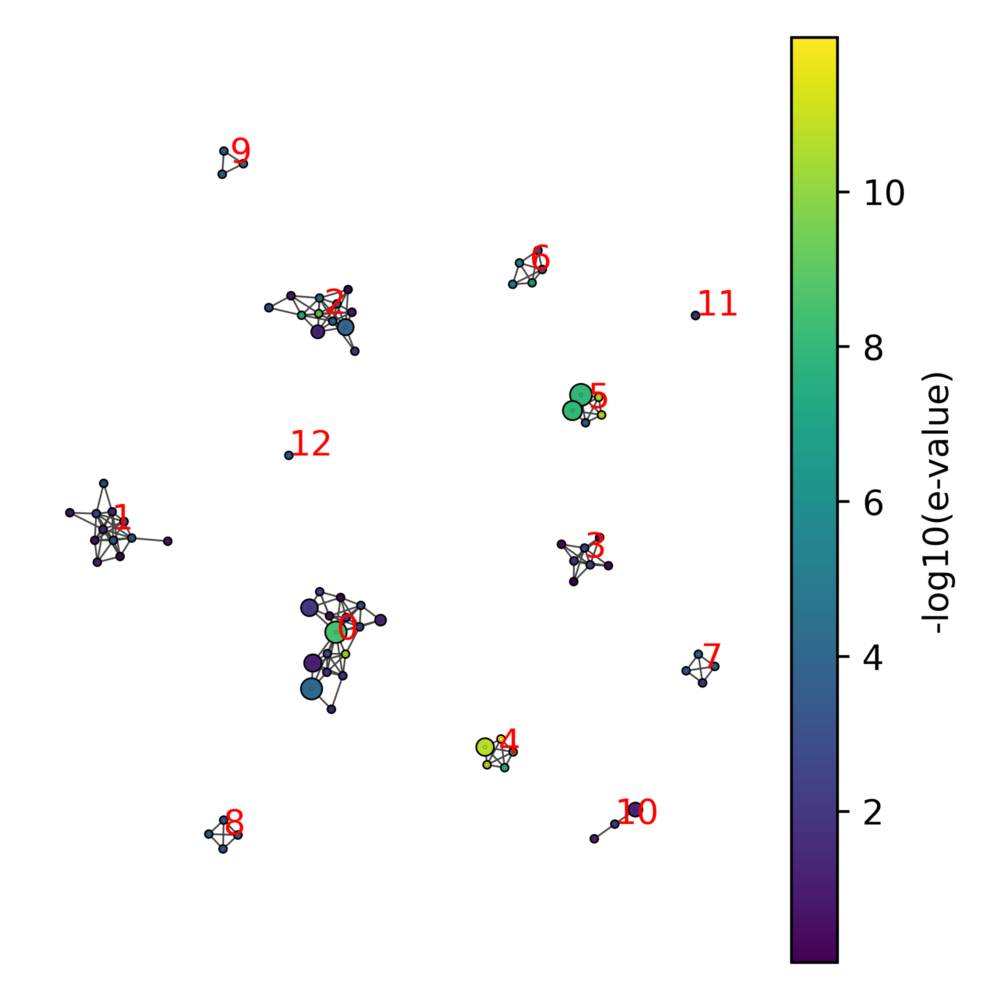

# Detection of antigen-driven convergent T-cell responses

[](https://pypi.org/project/clustcrdist/)

The **clustcrdist** library allows for statistical quantification of TCR sequence similarity through enrichment analysis of sequence neighbor counts. **clustcrdist** builds on the concept of TCR neighborhoods introduced in [Mayer-Blackwell et al. (2021), eLife](https://elifesciences.org/articles/68605). The library makes use of efficient vectorization in order to compute neighbor distributions. In addition it uses a novel strategy for generating TCR repertoire backgrounds that match important properties of the input repertoire such as V/J gene frequency, CDR3 length and non-templated nucleotide insertion in the CDR3. 

## Installation

**clustcrdist** is available as a [pypi package](https://pypi.org/project/clustcrdist/). To install the package, simply run:

```sh
pip install clustcrdist
```

> ⚠️ **Note:** Make sure you have Fortran compiler like `gfortran`, which is necessary for running certain dependencies of the software.

The package makes use of multiple sequence alignment (MSA) for some of the downstream visualizations. If you wish to use those functionalities, make sure to install the MSA tool.

Linux (Ubuntu):

```bash
sudo apt-get install mafft
```

macOS:

```bash
brew install mafft
```

Windows:

https://mafft.cbrc.jp/alignment/software/windows_without_cygwin.html

## Use

### Command line interface

By far the easiest way to run the analysis is through the using of the command line interface.

```
usage: clustcrdist [-h] [-f FILENAME] [-d DIRECTORY] [-r RADIUS] [-q RATIO] [-c CHAIN] [-s SPECIES] [-x SUFFIX] -o OUTDIR [--custom_background CUSTOM_BACKGROUND] [--custom_index CUSTOM_INDEX] [--downsample DOWNSAMPLE]

optional arguments:
  -h, --help            show this help message and exit
  -f FILENAME, --filename FILENAME
                        Path to the file that contains the repertoire of interest. When analyzing multiple files at once, please use the 'directory' argument.
  -d DIRECTORY, --directory DIRECTORY
                        Path to the directory that contains the repertoires of interest. When analyzing a single file, please use the 'filename' argument.
  -r RADIUS, --radius RADIUS
                        The radius for defining neighbors. Default is 12.5.
  -q RATIO, --ratio RATIO
                        The ratio between background and foreground. Only applicable when no custom background is provided. Default is 10.
  -c CHAIN, --chain CHAIN
                        TCR chain. AB for alphabeta. Default is B.
  -s SPECIES, --species SPECIES
                        Species. Default is human.
  -x SUFFIX, --suffix SUFFIX
                        A suffix to add to the output file name.
  -o OUTDIR, --outdir OUTDIR
                        Path to directory where results will be saved. If directory is non-existent, a new one will be created.
  --custom_background CUSTOM_BACKGROUND
                        The path to a custom background index file.
  --custom_index CUSTOM_INDEX
                        The path to a custom background file.
  --downsample DOWNSAMPLE
                        The number of sequences to downsample from the input file. Default is None.
```

**Example:**

```bash
clustcrdist --filename ./clustcrdist/data/test.tsv --chain AB --species human --radius 96 --ratio 10 --suffix result --outdir ./testresult/
```

**Note:**

When analyzing **multiple files**, the `-f` or `--filename` should remain **unspecified**. Instead  `-d` or `--directory` should be used.

### Accepted formats

The method accepts data in the [AIRR format](https://docs.airr-community.org/en/stable/datarep/rearrangements.html) or the paired TCRdist format. Data in the AIRR format should contain at least the following columns: *v_call*, *j_call*, *junction*, *junction_aa*. In case of using paired chain data, make sure the AIRR-formated data also includes the columns *cell_id* and *locus*. Data in the paired TCRdist format should contain at least the following columns: *va*, *ja*, *cdr3a*, *cdr3a_nucseq*, *vb*, *jb*, *cdr3b*, *cdr3b_nucseq*.

### Advanced use (python interface)

Alternatively, the python interface can be used, which allows for more flexibility and provides additional functionalities. 

#### Data formatting

The first important step is correctly formatting the TCR repertoire data. This implies that your data contains TCRs that satisfy the following specific criteria:

- Only canonical CDR3 sequences (N-terminal cysteine (**C**) and C-terminal phenylalanine (**F**), tryptophan (**W**) or cysteine (**C**)) that contain at least 4 and at most 30 amino acids. Non-amino acid characters are not allowed.
- V/J genes should be IMGT-formatted and must not include non-functional variants (ORFs/pseudogenes).
- The CDR3 nucleotide sequence should exactly match the CDR3 amino acid sequence.

To facilitate this formatting, you can make use of the `Repertoire` class. 

It is important to distinguish datasets in the single column or paired column format. Note that paired chain data may also be in the single column format, when TCRα and TCRβ chains are linked by the `cell_id`  column. Here are some examples of data in the **single column format**:

```
# EXAMPLE 1 (TRB only)
junction_aa	junction	v_call	j_call
CASSPQFTGSYEQYF	TGCGCCAGCAGCCCCCAGTTCACAGGCTCCTACGAGCAGTACTTC	TRBV4-3*01	TRBJ2-7*01
CASSSPIAGQSSYEQYF	TGTGCCAGCAGTTCCCCCATAGCGGGACAAAGCTCCTACGAGCAGT...	TRBV28*01	TRBJ2-7*01
CASSYGQNYNEQFF	TGCGCCAGCAGCTACGGACAGAACTACAATGAGCAGTTCTTC	TRBV5-1*01	TRBJ2-1*01
...

# EXAMPLE 2 (paired chain, but single column)
v_call	j_call	junction_aa	cell_id	locus
TRAV20*01	TRAJ3*01	CAVQAGWEASKIIF	AAGACCTAGTACACCT-1	TRA
TRAV19*01	TRAJ52*01	CALSEGAGGTSYGKLTF	ACGCCGAGTCTCTTAT-1	TRA
TRBV13*01	TRBJ2-2*01	CASSLQGAKSTGELFF	AAGACCTAGTACACCT-1	TRB
...
```

In contrast, paired column data contains separate columns for TCRα and TCRβ. Here is an example of what the **paired column format** looks like:

```
# EXAMPLE
cdr3a	cdr3a_nucseq	va	ja	cdr3b	cdr3b_nucseq	vb	jb
CVVKILTGGGNKLTF	TGTGTGGTGAAGATACTCACGGGAGGAGGAAACAAACTCACCTTT	TRAV12-1*01	TRAJ10*01	CASSPLADSSGSSYEQYF	TGTGCCAGCTCACCTCTCGCCGACAGCTCAGGGAGCTCCTACGAGCAGTACTTC	TRBV18*01	TRBJ2-7*01
CILADTGTASKLTF	TGCATCCTGGCCGATACCGGCACTGCCAGTAAACTCACCTTT	TRAV26-2*01	TRAJ44*01	CASKERGGLYEQYF	TGTGCCAGCAAGGAGCGGGGGGGCCTTTACGAGCAGTACTTC	TRBV11-2*01	TRBJ2-7*01
CALDMDGNTPLVF	TGTGCTCTAGACATGGACGGAAACACACCTCTTGTCTTT	TRAV6*01	TRAJ29*01	CASSPRQGAGANVLTF	TGTGCCAGCAGCCCCAGACAGGGAGCCGGGGCCAACGTCCTGACTTTC	TRBV5-4*01	TRBJ2-6*01
...
```

The code block below shows an example of how each of these would be formatted.

```python
from clustcrdist.repertoire import Repertoire
from clustcrdist import load_test

# EXAMPLE 1: single column format
data = load_test(column_type='single')
formatter = Repertoire(data)
data_formatted = formatter.filter_and_format_single(
    cdr3aa_col = 'junction_aa', # default
    cdr3nt_col = 'junction', # default
    vgene_col = 'v_call', # default
    jgene_col = 'j_call' # default
)

# EXAMPLE 2: paired column format
data = load_test(column_type='paired')
formatter = Repertoire(data)
data_formatted = formatter.filter_and_format_paired(
    cdr3aa_a_col = 'cdr3a', # default
    cdr3nt_a_col = 'cdr3a_nucseq', # default
    vgene_a_col = 'va', # default
    jgene_a_col = 'ja', # default 
    cdr3aa_b_col = 'cdr3b', # default
    cdr3nt_b_col = 'cdr3b_nucseq', # default
    vgene_b_col = 'vb', # default
    jgene_b_col = 'jb' # default
)	
```

#### Calculating neighbor distributions

The `find_neighbors` function provides a simple method for calculating the sequence neighbor distribution in your sample at a fixed TCRdist threshold *r*.

``` python
from clustcrdist.datasets import load_test

tcrs = clustcrdist.load_test() # test data -> change to your own data here
nbrs = find_neighbors(
    tcrs = tcrs,
    chain = 'AB',
    radius = 96,
)
```

#### Sequence neighbor enrichment

To add some interpretation to the neighbor counts, you can perform a neighbor enrichment analysis. This will compare the neighbor distribution in the sample with a synthetic background sample to estimate the expected neighbor counts. The code block below shows the most basic example where we run the analysis for a single paired &alpha;&beta; chain repertoire using a TCRdist radius of < 96.

 ```python
 from clustcrdist.neighbors import neighbor_analysis
 
 result = neighbor_analysis(
     tcrs = tcrs,
     chain = 'AB', # paired chain (alpha-beta)
     organism = 'human',
     radius = 96 # TCRdist distance radius
 )
 ```

##### Clustering

After running the analysis, you can access the data in the `SneTcrResult` object. If you want to perform clustering on the enrichment results, you should run `.get_clusters()` before extracting the results.

```python
res.get_clusters(
    r = 96.5,
    periphery = True # if set to True, this will include the 'periphery' (all neighbors) around each SNE
) # this will add a 'cluster' column to the results table
clustered_results = res.to_df() # extracts the results table as a pandas.DataFrame
```

##### Visualization

After clustering, the results can be visualized as a network:

```python
import matplotlib.pyplot as plt

fig, ax = plt.subplots(dpi=150, figsize=(4,4))
res.draw_neighborhoods(
    ax = ax, 
    node_size = 'duplicate_count', # Will use the duplicate_count column to set the node size
    annotate = True # Adds the cluster labels
)
```



In addition, each cluster can be individually inspected to gain more insight into the V/J gene usage and the CDR3 amino acid motif.

```python
fig = res.draw_cluster(
    cluster_id=1, 
    labels=False, 
    node_size='duplicate_count'
)
```


#### Calculating the pairwise distance matrix using vectorized TCRdist 

If you want to calculate the pairwise distances among a set of TCRs, you can simply run the example provided in this code block. This will produce a sparse distance matrix where zero-distances are encoded as -1. Here, *r* will determine the maximum distance that is included. Increasing *r* will slow down the computing time. Note that when *r* is very large, this may result in memory issues.

```python
from clustcrdist.distance import compute_sparse_distance_matrix

dm = compute_sparse_distance_matrix(
    tcrs = tcrs,
    chain = 'AB',
    organism = 'human',
    r = 96
)
```

#### Generating background data

The following functionality allows you to generate a set of background TCRs that match a range of characteristics in the provided data. These include matching **V** and **J** gene frequency, **CDR3 amino acid length** distribution, and the number of **n-inserted nucleotides** in the CDR3. The size of the background can be specified as a factor of the input data. By default, the model will generate a background dataset that is 10x the size of the input data.

```python
from clustcrdist.background import BackgroundModel

bgmodel = BackgroundModel(
	repertoire = tcrs,
	factor = 5 # relative to the size of the input data
)

background = bgmodel.shuffle(chain='AB') # specify the chain here
```

#### *vecTCRdist* (TCRdist-based TCR encoding)

The TCRdist-based encoding *vecTCRdist* is a transformation of the TCRdist distance matrix, that enables accurate approximations of TCRdist distances in euclidean space. *vecTCRdist* captures information from CDR1, CDR2, CDR2.5, and CDR3.

```python
from clustcrdist.encoding import TCRDistEncoder

encoder = TCRDistEncoder(
    aa_dim = 8, # number of dimensions per amino acid
    organism = 'human'
    chain = 'AB'
)
```
